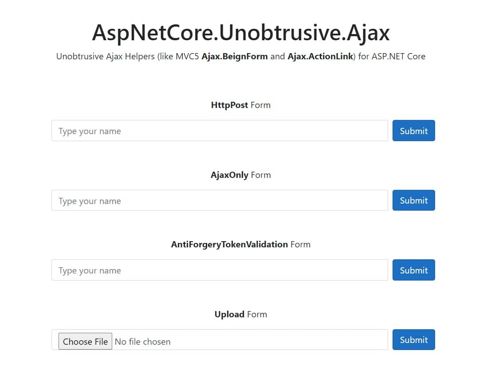

# AspNetCore.Unobtrusive.Ajax

Unobtrusive Ajax Helpers (like MVC5 Ajax.BeignForm and Ajax.ActionLink) for ASP.NET Core.

## Features

*   Easy-to-Use with just one line of code.
*   Adds necessary JS script automatically when you use a Ajax Helpers and remove JS script when you no longer use it.
*   Uses CDN url instead of Embedded script (Optional).

## Demo

Checkout [AspNetCore.Unobtrusive.Ajax.Demo](https://github.com/mjebrahimi/AspNetCore.Unobtrusive.Ajax/tree/master/demo/AspNetCore.Unobtrusive.Ajax.Demo) for more samples.

